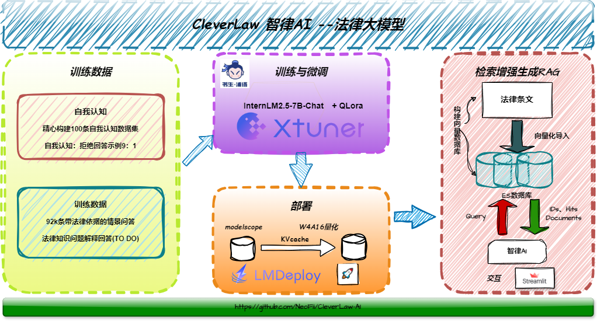

# CleverLaw-AI

### 项目简介
智律AI(CleverLaw-AI)是基于InternLM微调，应用于法律垂直领域的专业大模型。旨在从专业的角度为用户提供便捷、准确的法律咨询服务。通过与智律AI对话，用户可以获取关于法律问题的解答、建议和指导，从而更好地了解自己的权利和义务，有效解决法律难题。

### 架构图

### 项目功能
 - 智律AI提供基础的AI大模型对话功能，通过与智律AI对话，用户可以获取关于法律问题的解答、建议和指导，从而更好地了解自己的权利和义务，有效解决法律难题。通过提问让模型给出专业的回答，满足法律问题的查询需求和法律词条的查询需求。

### 训练数据
 - 智律AI的训练数据数据均是来自国内权威机构，如“中国法律服务网”、“中国法律法规数据库”等，确保模型回答严谨、专业，感谢[LAW-GPT](https://github.com/LiuHC0428/LAW-GPT)提供的开源训练数据。

### 技术方案
 - 基于InternLM模型使用Xtuner工具进行Qlora、SFT微调，确保模型能够准确地学习到训练数据中的知识，依据用户的指令准确输出回答；
 - 基于LMDeploy部署LLM，使用KVcache量化加速推理；
 - 基于ES数据库连接LLM实现RAG，增强模型对新发布的法律法规的学习，确保模型能够准确回答，及时更新数据库。

### 致谢

- 感谢书生浦语社区开发者的卓越贡献
- 感谢OpebXLab提供的算力支持
- 感谢书生浦语大模型实战营第三期的开展

如果你对大模型也感兴趣，渴望探索LLM的神秘与未知，欢迎了解[大模型实战营](https://github.com/InternLM/Tutorial)
